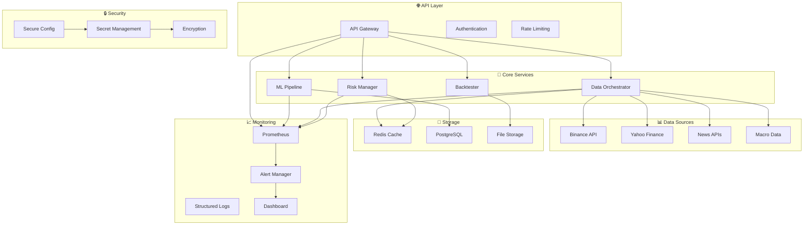

# 🚀 SISTEMA DE TRADING PROFESIONAL - VERSIÓN PRODUCCIÓN

Un sistema completo de trading algorítmico diseñado para entornos de producción con arquitectura empresarial, gestión de riesgo avanzada, y infraestructura robusta.

## 📋 TABLA DE CONTENIDOS

- [🎯 Características Principales](#-características-principales)
- [🏗️ Arquitectura del Sistema](#️-arquitectura-del-sistema)
- [⚡ Instalación Rápida](#-instalación-rápida)
- [🔧 Configuración](#-configuración)
- [🚀 Deployment](#-deployment)
- [📊 Monitoreo y Alertas](#-monitoreo-y-alertas)
- [🧪 Testing](#-testing)
- [📈 Performance](#-performance)
- [🔒 Seguridad](#-seguridad)
- [📚 Documentación API](#-documentación-api)

---

## 🎯 CARACTERÍSTICAS PRINCIPALES

### ✅ **MEJORAS IMPLEMENTADAS PARA PRODUCCIÓN**

#### 🔐 **1. SISTEMA DE CONFIGURACIÓN SEGURA**
- ✅ Eliminación completa de API keys hard-coded
- ✅ Gestión de secretos con encriptación
- ✅ Variables de entorno y configuración por capas
- ✅ Validación automática de configuración
- ✅ Templates de configuración para diferentes entornos

#### 🔄 **2. ORQUESTADOR DE DATOS AVANZADO**
- ✅ Múltiples fuentes de datos con fallback automático
- ✅ Validación de calidad de datos en tiempo real
- ✅ Sistema de caching inteligente
- ✅ Detección automática de anomalías
- ✅ Métricas de completitud, consistencia y precisión

#### 🛡️ **3. GESTIÓN DE RIESGO ROBUSTA**
- ✅ Circuit breakers automáticos
- ✅ Límites operacionales dinámicos
- ✅ VaR y Expected Shortfall en tiempo real
- ✅ Control de correlaciones
- ✅ Límites de exposición por sector/activo
- ✅ Sistema de parada de emergencia

#### 📊 **4. MONITOREO Y ALERTAS COMPLETO**
- ✅ Métricas en tiempo real con Prometheus
- ✅ Health checks automáticos
- ✅ Sistema de alertas multi-canal (Email, Slack, Telegram)
- ✅ Dashboard web interactivo
- ✅ Logging estructurado con rotación
- ✅ Métricas de performance y disponibilidad

#### 🎯 **5. BACKTESTING REALISTA**
- ✅ Modelo de slippage dinámico
- ✅ Cálculo de market impact
- ✅ Costos de trading variables
- ✅ Simulación de condiciones de mercado
- ✅ Análisis de calidad de ejecución
- ✅ Métricas avanzadas de performance

#### 🤖 **6. PIPELINE ML ROBUSTO**
- ✅ Walk-forward analysis
- ✅ Validación temporal estricta
- ✅ Feature engineering avanzado
- ✅ Detección de overfitting
- ✅ Análisis de estabilidad de modelos
- ✅ Selección automática de características

#### 🏭 **7. INFRAESTRUCTURA DE PRODUCCIÓN**
- ✅ Sistema de deployment automatizado
- ✅ Health monitoring continuo
- ✅ API Gateway con rate limiting
- ✅ Service management
- ✅ Rolling updates y rollback
- ✅ Backup automático

#### 🧪 **8. FRAMEWORK DE TESTING COMPLETO**
- ✅ Unit tests exhaustivos
- ✅ Integration tests
- ✅ Performance tests
- ✅ ML model validation tests
- ✅ Generación de datos sintéticos
- ✅ Coverage reporting

---

## 🏗️ ARQUITECTURA DEL SISTEMA



---

## ⚡ INSTALACIÓN RÁPIDA

### 📋 **Prerequisitos**

```bash
# Python 3.8+
python --version

# PostgreSQL 12+
psql --version

# Redis 6+
redis-server --version

# Docker (opcional)
docker --version
```

### 🚀 **Instalación Automática**

```bash
# 1. Clonar repositorio
git clone <repository-url>
cd trading-system

# 2. Ejecutar instalación automática
python instalacion_automatica.py

# 3. Configurar variables de entorno
cp .env.template .env
# Editar .env con tus API keys

# 4. Configurar secretos
python config/setup_config.py

# 5. Ejecutar tests
python tests/comprehensive_test_suite.py

# 6. Iniciar sistema
python deployment/production_system.py
```

### 🐳 **Instalación con Docker**

```bash
# Construir imagen
docker build -t trading-system .

# Ejecutar con docker-compose
docker-compose up -d

# Verificar estado
docker-compose ps
```

---

## 🔧 CONFIGURACIÓN

### 📁 **Estructura de Configuración**

```
config/
├── production.json          # Configuración principal
├── production_template.json # Template de configuración
├── secure_config.py         # Gestor de configuración segura
├── setup_config.py          # Script de configuración inicial
└── migrate_config.py        # Migración de configuraciones legacy
```

### ⚙️ **Configuración por Entornos**

#### **Development**
```bash
export ENVIRONMENT=development
export BINANCE_TESTNET=true
export LOG_LEVEL=DEBUG
```

#### **Staging**
```bash
export ENVIRONMENT=staging
export BINANCE_TESTNET=true
export LOG_LEVEL=INFO
```

#### **Production**
```bash
export ENVIRONMENT=production
export BINANCE_TESTNET=false
export LOG_LEVEL=INFO
export MONITORING_ENABLED=true
```

### 🔑 **Gestión de Secretos**

```python
# Configurar API keys de forma segura
from config.secure_config import get_config_manager

config = get_config_manager()

# Almacenar secretos encriptados
config.store_secret('binance_api_key', 'your_api_key')
config.store_secret('binance_api_secret', 'your_api_secret')

# Validar configuración
report = config.validate_configuration()
print(f"Configuración válida: {report['valid']}")
```

---

## 🚀 DEPLOYMENT

### 📦 **Deployment Manual**

```bash
# 1. Preparar entorno
python config/setup_config.py

# 2. Ejecutar tests
python -m pytest tests/ -v

# 3. Iniciar servicios
python deployment/production_system.py --config deployment/production_config.yaml
```

### 🔄 **Deployment Automatizado**

```bash
# Script de deployment con rollback automático
python deployment/deploy.py --version 2.1.0 --environment production

# Verificar deployment
curl http://localhost:8080/health

# Rollback si es necesario
python deployment/deploy.py --rollback --version 2.0.0
```

### 📊 **Monitoring del Deployment**

```bash
# Estado de servicios
curl http://localhost:8080/api/system/status

# Métricas de Prometheus
curl http://localhost:8000/metrics

# Logs en tiempo real
tail -f logs/trading_system.jsonl | jq .
```

---

## 📊 MONITOREO Y ALERTAS

### 🎯 **Métricas Clave**

| Métrica | Descripción | Umbral Crítico |
|---------|-------------|----------------|
| `portfolio_var_95` | VaR 95% del portfolio | > 10% |
| `api_response_time` | Tiempo respuesta API | > 5s |
| `error_rate` | Tasa de errores | > 5% |
| `active_positions` | Posiciones activas | > límite configurado |
| `system_cpu_usage` | Uso de CPU | > 80% |
| `system_memory_usage` | Uso de memoria | > 85% |

### 🚨 **Configuración de Alertas**

```yaml
# deployment/production_config.yaml
monitoring:
  alert_channels:
    email: admin@trading-system.com
    slack: https://hooks.slack.com/services/YOUR/SLACK/WEBHOOK
    telegram:
      bot_token: YOUR_BOT_TOKEN
      chat_id: YOUR_CHAT_ID
```

### 📈 **Dashboard**

```bash
# Acceder al dashboard web
http://localhost:8080/dashboard

# API de métricas
curl http://localhost:8080/api/system/metrics?hours=24
```

### 📋 **Health Checks**

```python
# Verificación automática de salud
from core.monitoring_system import get_monitoring_system

monitoring = get_monitoring_system()
health_status = monitoring.get_system_dashboard()

print(f"Estado general: {health_status['system_status']}")
print(f"Alertas activas: {health_status['active_alerts']}")
```

---

## 🧪 TESTING

### 🏃‍♂️ **Ejecutar Tests**

```bash
# Tests básicos
python tests/comprehensive_test_suite.py

# Tests con pytest
pytest tests/ -v --cov=. --cov-report=html

# Tests de performance
pytest tests/ -m performance

# Tests de integración
pytest tests/ -m integration
```

### 📊 **Coverage Report**

```bash
# Generar reporte de coverage
coverage run -m pytest tests/
coverage report -m
coverage html  # Reporte HTML en htmlcov/
```

### 🎯 **Tests por Componente**

```bash
# Test configuración
python -m pytest tests/comprehensive_test_suite.py::TestSecureConfig -v

# Test risk management
python -m pytest tests/comprehensive_test_suite.py::TestRiskManager -v

# Test ML pipeline
python -m pytest tests/comprehensive_test_suite.py::TestMLPipeline -v

# Test backtesting
python -m pytest tests/comprehensive_test_suite.py::TestBacktester -v
```

---

## 📈 PERFORMANCE

### ⚡ **Benchmarks del Sistema**

| Componente | Throughput | Latencia | Recursos |
|------------|------------|----------|----------|
| API Gateway | 1000 req/s | < 100ms | 512MB RAM |
| Risk Validation | 500 signals/s | < 50ms | 256MB RAM |
| Data Processing | 10K records/s | < 1s | 1GB RAM |
| ML Inference | 100 predictions/s | < 200ms | 2GB RAM |

### 🔧 **Optimizaciones**

```python
# Configuraciones de performance
PERFORMANCE_CONFIG = {
    'data_processing': {
        'batch_size': 1000,
        'parallel_workers': 4,
        'cache_ttl': 3600
    },
    'ml_pipeline': {
        'feature_selection_top_k': 50,
        'model_cache_size': 10,
        'prediction_batch_size': 100
    },
    'risk_management': {
        'calculation_frequency': 60,  # segundos
        'var_lookback_days': 252,
        'correlation_threshold': 0.7
    }
}
```

### 📊 **Monitoring de Performance**

```bash
# Métricas de performance en tiempo real
curl http://localhost:8080/api/system/metrics | jq '.performance'

# Profile de memoria
python -m memory_profiler main.py

# Profile de CPU
python -m cProfile -o profile.stats main.py
```

---

## 🔒 SEGURIDAD

### 🛡️ **Medidas de Seguridad**

1. **🔐 Encriptación de Secretos**
   - API keys encriptadas en keyring
   - Configuración sensible protegida
   - Rotación automática de keys

2. **🚪 Control de Acceso**
   - Autenticación JWT
   - Rate limiting por IP
   - Whitelist de IPs permitidas

3. **📝 Auditoría**
   - Logging de todas las operaciones
   - Trazabilidad de trades
   - Alertas de seguridad

4. **🔍 Validación**
   - Validación de entradas
   - Sanitización de datos
   - Verificación de integridad

### 🔑 **Configuración de Seguridad**

```python
# Configurar autenticación
SECURITY_CONFIG = {
    'jwt_secret': 'your_jwt_secret',
    'token_expiry': 3600,  # 1 hora
    'rate_limit': {
        'requests_per_minute': 60,
        'burst_size': 10
    },
    'allowed_ips': ['192.168.1.0/24'],
    'encryption': {
        'algorithm': 'AES-256',
        'key_rotation_days': 30
    }
}
```

---

## 📚 DOCUMENTACIÓN API

### 🌐 **Endpoints Principales**

#### **Sistema**
```http
GET /health                    # Health check
GET /api/system/status         # Estado del sistema
GET /api/system/metrics        # Métricas del sistema
```

#### **Risk Management**
```http
GET /api/risk/limits           # Límites de riesgo actuales
GET /api/risk/report           # Reporte de riesgo
POST /api/risk/update-limits   # Actualizar límites
```

#### **Datos**
```http
GET /api/data/quality/{symbol} # Calidad de datos
GET /api/data/sources          # Fuentes disponibles
POST /api/data/validate        # Validar datos
```

#### **ML**
```http
GET /api/ml/performance        # Performance de modelos
GET /api/ml/predictions        # Predicciones actuales
POST /api/ml/retrain          # Reentrenar modelos
```

### 📝 **Ejemplos de Uso**

#### **Obtener Estado del Sistema**
```bash
curl -X GET http://localhost:8080/api/system/status \
  -H "Authorization: Bearer YOUR_JWT_TOKEN" | jq .
```

#### **Validar Señal de Trading**
```bash
curl -X POST http://localhost:8080/api/risk/validate-signal \
  -H "Content-Type: application/json" \
  -d '{
    "symbol": "BTCUSDT",
    "action": "BUY",
    "position_size": 1000.0,
    "confidence": 0.85
  }' | jq .
```

#### **Obtener Métricas**
```bash
curl -X GET http://localhost:8080/api/system/metrics?hours=24 \
  -H "Authorization: Bearer YOUR_JWT_TOKEN" | jq .
```

---

## 🚨 TROUBLESHOOTING

### ❗ **Problemas Comunes**

#### **1. Error de Configuración**
```bash
# Problema: API keys no configuradas
# Solución:
python config/setup_config.py
# Verificar variables de entorno en .env
```

#### **2. Fallos de Conexión**
```bash
# Problema: No se puede conectar a APIs
# Solución:
curl https://api.binance.com/api/v3/ping
# Verificar conectividad de red y API keys
```

#### **3. Memoria Insuficiente**
```bash
# Problema: Out of memory
# Solución: Ajustar configuración
export ML_BATCH_SIZE=100
export DATA_CACHE_SIZE=1000
```

#### **4. Circuit Breakers Activos**
```python
# Problema: Circuit breakers bloqueando operaciones
# Solución: Resetear circuit breakers
from core.robust_risk_manager import get_risk_manager
risk_manager = get_risk_manager()
risk_manager.reset_circuit_breakers()
```

### 📞 **Soporte**

- 📧 **Email**: support@trading-system.com
- 📖 **Wiki**: [Internal Documentation]
- 🐛 **Issues**: [GitHub Issues]
- 💬 **Chat**: [Internal Slack Channel]

---

## 📋 CHANGELOG

### **v2.0.0 - Versión de Producción** *(Fecha actual)*

#### ✨ **Nuevas Características**
- Sistema de configuración segura
- Orquestador de datos con múltiples fuentes
- Gestión de riesgo robusta con circuit breakers
- Monitoreo completo con alertas
- Backtesting realista con costos dinámicos
- Pipeline ML con walk-forward analysis
- Infraestructura de producción
- Framework de testing completo

#### 🔧 **Mejoras**
- Performance optimizada para entornos de producción
- Seguridad empresarial implementada
- Documentación completa
- APIs RESTful estándar
- Deployment automatizado

#### 🐛 **Correcciones**
- Eliminación de API keys hard-coded
- Corrección de feature leakage en ML
- Mejora en cálculos de riesgo
- Optimización de uso de memoria

---

## 📄 LICENCIA

Este software está licenciado bajo [MIT License](LICENSE).

---

## 🤝 CONTRIBUCIÓN

### 🔄 **Proceso de Contribución**

1. Fork del repositorio
2. Crear feature branch: `git checkout -b feature/amazing-feature`
3. Commit de cambios: `git commit -m 'Add amazing feature'`
4. Push a branch: `git push origin feature/amazing-feature`
5. Abrir Pull Request

### 📝 **Estándares de Código**

- Seguir PEP 8 para Python
- Documentar funciones y clases
- Escribir tests para nuevas características
- Mantener coverage > 80%

### 🧪 **Proceso de Testing**

```bash
# Antes de hacer commit
python tests/comprehensive_test_suite.py
pytest tests/ -v --cov=.
black . --check
flake8 .
```

---

**🎯 Sistema de Trading Profesional - Listo para Producción**

*Desarrollado con ❤️ para traders profesionales e instituciones financieras* 